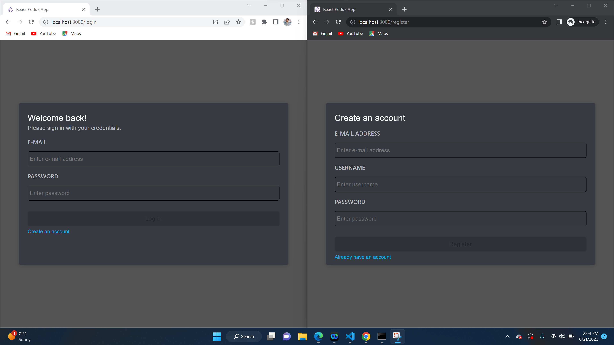
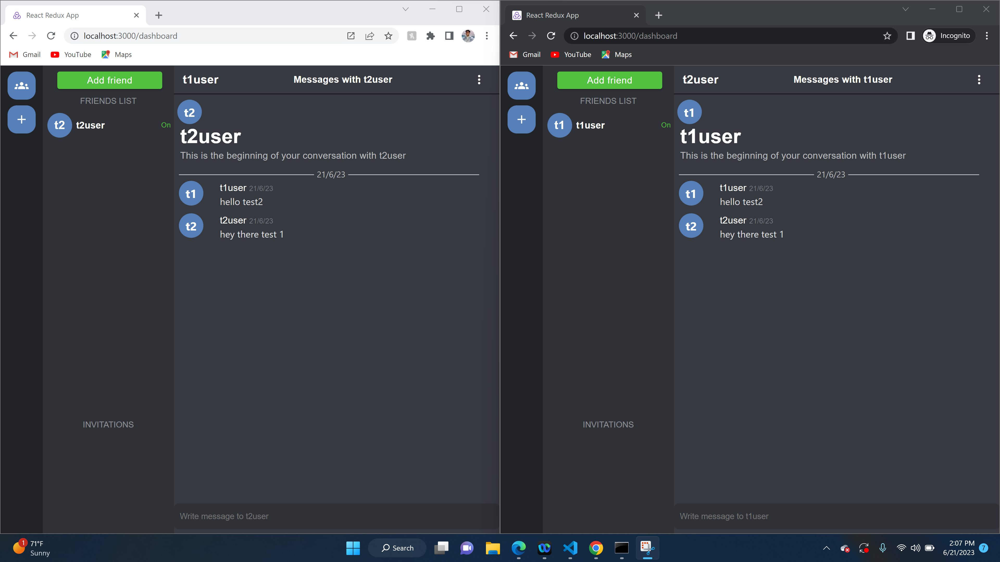
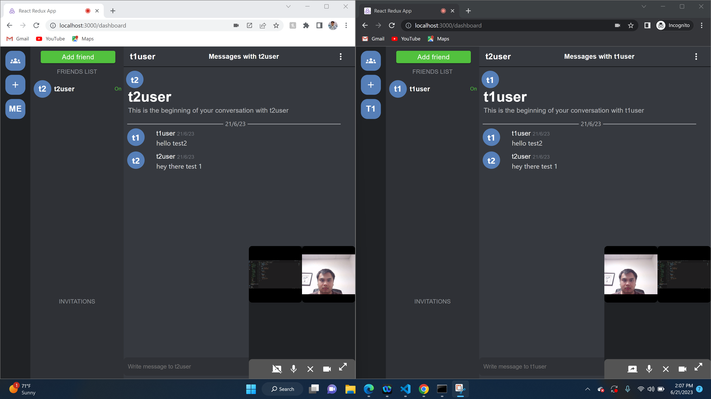

# Real-time Chat Web Application
This repository contains the source code for a real-time chat web application, built with the MERN stack (MongoDB, Express.js, React, Node.js). The application offers a dynamic, intuitive, and robust platform for real-time communication, mirroring popular messaging platforms in functionality and user experience.

## Key Features:
**Real-time communication:** Built with Socket.io, the application enables instant messaging across multiple users.  
**Multiple Chat Rooms:** Users can join and participate in various chat rooms for different topics.  
**Direct Messages:** Users can send direct, private messages to other users.  
**Multimedia and Screen Sharing:** The application supports sharing of multimedia content, including images, videos, and files.  
**Voice, Video, and Screen Sharing Chat:** Integrated with WebRTC to facilitate direct peer-to-peer communication for voice, video, and screen sharing chat.  
## Technologies Used:
**Front-end:** React for building user interface components.  
**Back-end:** Node.js and Express.js for server-side operations.  
**Database:** MongoDB for storing chat data and user information.  
**Real-time Communication:** Socket.io for real-time event-based communication.  
**Voice, Video, and Screen Sharing Chat:** WebRTC for peer-to-peer communication.  
This application serves as a demonstration of my proficiency in full-stack development, real-time web technologies, and database management.  

## Notes for those that want to run this on their own
You can see the packages that I am using for this project in the backend and frontend folders and their versions. To install these packages follow these steps  
1. Create a folder on your desktop, and with in that folder, create a frontend and backend folder
2. Open your command portal and navigate to your desired folder
   * **example for backend:** cd downloads\nameofyourfile\nameofyourbackendfile
   * **example for frontend:** cd downloads\nameofyourfile\nameofyourfrontendfile
3. See all the libraries that I have in my package.JSON of both folders and install them with npm install
   * **example for backend:** npm install bcryptjs cors dotenv express express-joi-validation joi jsonwebtoken mongoose nodemon socket.io uuid
   * **example for frontend:** npm install @emotion/react @emotion/styled @mui/icons-material @mui/material axios react react-dom react-redux react-router-dom react-scripts redux-thunk simple-peer socket.io-client
       
You can see the the versions of the installed libraries on the files in the folders. Note that if you use the npm install method provided, you will install the latest version of the libraries so for anyone trying to run this in the future you may have to adjust the code to be compatible with updated libraries.
  
You should also check out the [`.env`](webapp-source-backend/.env) file in the webapp-backend folder I have provided and make sure you put your own MONGO URI from your mongodb.

## Screen shots of the running webapp  
### Login and register functionality

### Direct messaging with friends functionality
  
### Voice and video calling with screensharing functionality

### video link demonstration on the way
